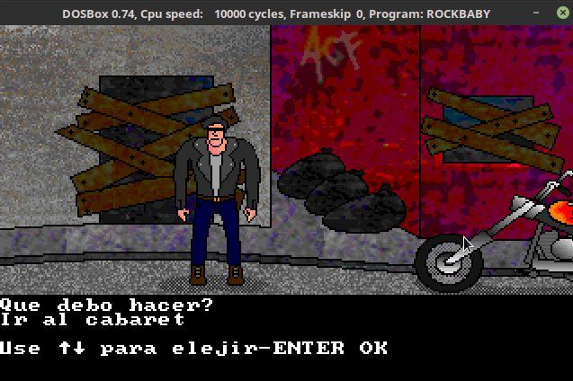

# Aventura Grafica

Motor de aventura grafica + 2 aventuras, para MS-DOS, creado en 1998 en un 486 DX2 

Graphic adventure engine for MS-DOS, plust 2 adventures. 

## Informacion

Programado en ASIC Basic y Assembler en 1998-1999

El motor tiene un lenguaje de scripting propio, que permite crear aventuras graficas genericas.

Muy inspirado en las viejas aventuras de texto, y los juegos de LucasArts

Hice este programa cuando tenia 16 años en mi segunda computadora, un 486 DX2...

Que lo disfruten!!

Para jugarlo, usar MS-DOS, o un emulador como DOSBOX... hay binarios compilados y dos aventuras graficas, una demo corta, y una aventura grafica completa para jugar!

## Estructura

dentro de DOSBOX/ estan los juegos listos para jugar en DOSBOX

dentro de CODIGO/ esta el codigo fuente original

## Herramientas necesarias

Se compila con ASIC BASIC 

Se comprime con UPX para MS DOS

El instalador se hizo con RAR 2.5

Todas herramientas para MS DOS

## Screenshoots

Jugando en DOSBOX sobre Linux

